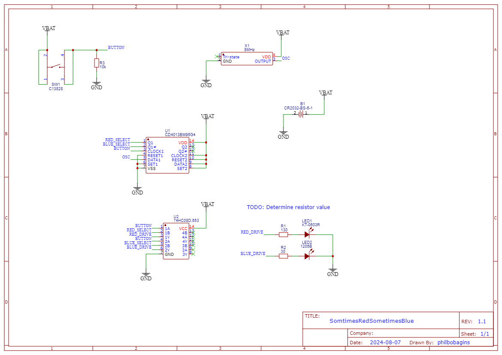

# Sometimes red, sometimes blue PCB

*Warning: Design is not finished yet*

## Simulation

[Simulation can be found here](https://www.falstad.com/circuit/circuitjs.html?ctz=CQAgjCAMB0l3BWEDoE4DMAWATKhl0A2AdnVW0gA5lJkbkBTAWjDACgwEkxtrVDwxAfyjI2AJXC8QIwphkCI2GrTDRu60TAQd8IbMWWVaRasdHKTu2geVghIU4IE3R6NgHd92eSNsKoT295MEIbQ3AwwK8fVXJHO3jIIPRE5VSpamSvDLl9CLzs-LT9TDjLNgAnR0IzWkwM81V0ZOqnewEGuwcTZKwQADMPABNKgHsABwAdAEc7fWYwWhNoTEJsMntiVGJMUiwkKPZQ5UxzcwRpc3RBkfHpufAtKFh2fqHRydmbpUXl5GgYAwCEoQkI-GwS0gECOHHWIDOqgcl2oHUct0+Dxu-wgMGhbAA5sgjsiotgEC5osTaBcSS4gijnNSmUVGbSacs2AAPBGUEKXZAZThIeQ+EAAIQANgBXBjc3k3BDEZAGEBRUXycQMYYpOzSHio6RFIXSXLyVogFiKTDyK36KiiKFwQmW0L26h28mU416j1ug1Uu0Bph5APJSQsHiZV1RpqiMro-7aNgAZxjvstoaNTwALpVZUEgzbXYojWx0MR6kKHIimbjAhWq0Z6udVFo2GMnoUEZBUKg6Hj4DtCBTyRYnu5O2Lu2U+y94JAhLgyJgEOgeEhB3Bh6PN-pSo42EA)

## TODO

After playing with the initial prototype, I think I should do the following:

* [ ] Add a hole so the PCB can be used a keyring, necklace, etc
* [x] Replace the resonator circuit with an off the shelf oscillator device
* [x] Round the PCB corners even if that means losing some or all of the screw/necklace/keyring holes - just to make Joel happy ... also because it's a good idea
* [x] Consider a dual channel AND gate IC instead of two single channel ICs
* [x] Consider larger IC for everything ... they were all very fiddly to hand solder
* [ ] Consider adding test points
* [...] Consider how much current I want to drive the LEDs with, then choose resistors and consider adding a FET between the AND gate output and the resistor
* [ ] Make sure a battery fits properly in the holder
* [ ] Ensure battery holder doesn't collide with button pins
* [x] RESET1 and SET1 (pins 4 and 6 on U1) should be low, not high ... otherwise the D flip flop doesn't work and both LEDs turn on when the button is pressed

## Design files

This board was designed using [EasyEDA](https://easyeda.com/).

Exports from EasyEDA are [available in a subdirectory](./Exports-v1.0).

## Licence

Copyright © 2017, 2018, 2022, 2024 Phil Baldwin

This work is licensed under a Creative Commons Attribution-ShareAlike 4.0 International License.

You should have received a copy of the license along with this work. If not, see <http://creativecommons.org/licenses/by-sa/4.0/>.
